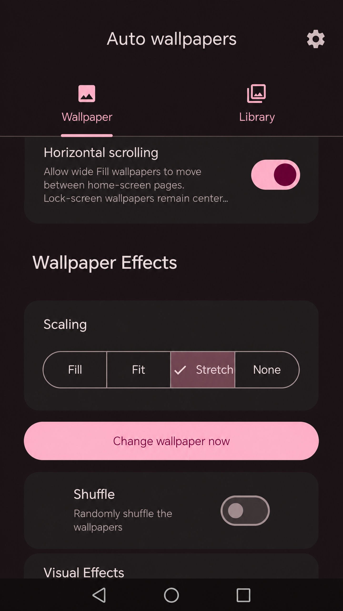
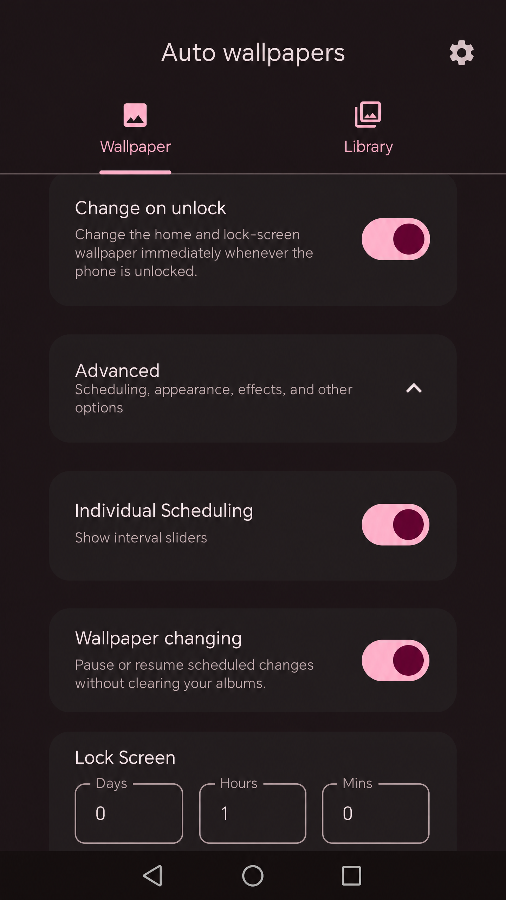
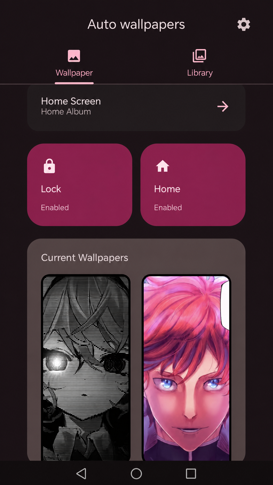
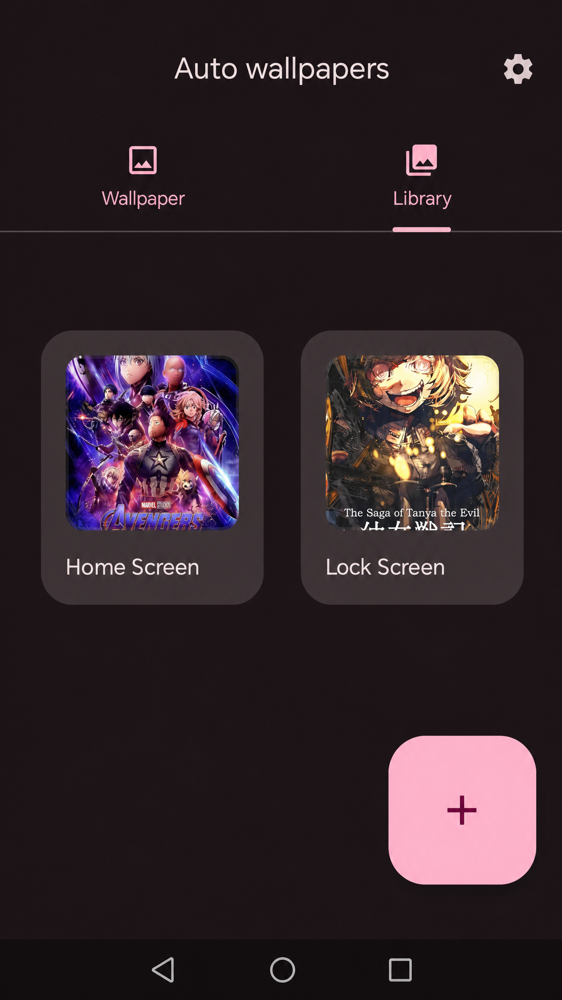
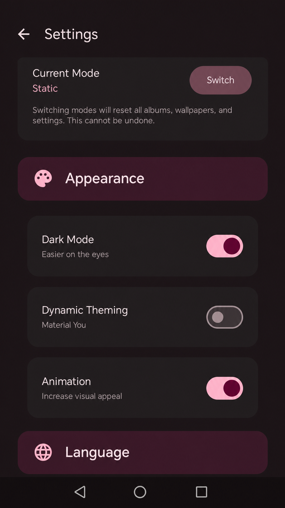

# Auto wallpapers

> **مدير خلفيات أنمي تلقائي لهواتف Android**

**Auto wallpapers** هو تطبيق Android مشتق من مشروع Paperize 4.0.3، وأعيد تخصيصه ليكون مديرًا عمليًا لخلفيات الأنمي. وظيفته الأساسية هي اختيار صور أنمي من مجلدات الهاتف، تنظيمها في ألبومات مستقلة، ثم تطبيقها تلقائيًا على الشاشة الرئيسية وشاشة القفل وفق جدول زمني يحدده المستخدم أو فور فتح قفل الهاتف.

لا يحتاج التطبيق إلى إبقاء واجهته مفتوحة حتى يعمل. بعد ضبط الألبومات والجدولة مرة واحدة، يعتمد على مكونات Android الخاصة بالمهام الخلفية والمنبهات ومستقبلات النظام لتنفيذ تغيير الخلفية خارج عمر الشاشة الرئيسية للتطبيق. ويستخدم `AlarmManager` للجدولة الدقيقة، مع مسار احتياطي يعتمد على `WorkManager`، كما يعيد جدولة المهام بعد إعادة تشغيل الهاتف. وتستقبل ميزة **Change on unlock** حدث `USER_PRESENT` لتغيير الخلفية مباشرة بعد نجاح فتح القفل، وليس عند قفل الهاتف.

## الوظيفة الأساسية

يمكن اعتبار التطبيق مديرًا لألبومات خلفيات الأنمي، وليس مجرد عارض صور. يختار المستخدم مجلدًا يحتوي على صور الأنمي من خلال منتقي مجلدات Android، فيُنشئ التطبيق ألبومًا باسمه الأصلي ويحتفظ بحق القراءة اللازم للوصول إلى الصور لاحقًا. بعد ذلك يحدد المستخدم ألبوم الشاشة الرئيسية وألبوم شاشة القفل، ثم يختار طريقة التغيير المناسبة له.

| طريقة التغيير | السلوك |
|---|---|
| **الجدولة الزمنية** | يغير التطبيق الخلفيات تلقائيًا حسب الفواصل التي يحددها المستخدم، مثل الساعات والدقائق والأيام. |
| **Change on unlock** | يغير خلفية الشاشة الرئيسية وشاشة القفل فورًا عند فتح الهاتف. لا يغير الخلفية عند قفل الهاتف. |
| **Change wallpaper now** | يطبق الخلفية التالية يدويًا في الحال لاختبار الألبومات والإعدادات. |
| **Wallpaper changing** | يتيح إيقاف التغييرات المجدولة مؤقتًا أو استئنافها دون حذف الألبومات. |

تعمل الجدولة خارج واجهة التطبيق؛ إذ تسمح `AlarmManager` بتشغيل عمليات مرتبطة بالوقت حتى عندما لا تكون واجهة التطبيق مفتوحة، كما يمكن إعادة إنشاء المنبهات بعد إعادة تشغيل الجهاز باستخدام `RECEIVE_BOOT_COMPLETED`.[1] ويجب تذكر أن Android قد يؤخر بعض العمليات في وضع Doze أو عند فرض قيود البطارية، لذلك يتضمن التطبيق إعدادات الجهاز المطلوبة لضمان أفضل موثوقية.[2]

## الميزات الرئيسية

### ألبومات أنمي متعددة

يفتح زر **+** في تبويب **Library** منتقي المجلدات مباشرة، من دون خطوة إنشاء اسم ألبوم يدويًا. يحافظ التطبيق على اسم المجلد الأصلي الذي يعيده نظام Android، ويسمح باستيراد أكثر من مجلد، بما في ذلك مجلدات تحمل الاسم نفسه؛ إذ يحصل كل مجلد على معرف ألبوم مستقل من دون إعادة تسمية تلقائية مثل `(2)`.

يمكن تعيين ألبوم منفصل للشاشة الرئيسية وآخر لشاشة القفل، كما يمكن تفعيل أو تعطيل كل وجهة بشكل مستقل من البطاقات **Home** و **Lock**. وتعرض لوحة **Current Wallpapers** معاينة الخلفيات المطبقة حاليًا.

### مؤثرات العرض

يتضمن التطبيق إعدادات للتحكم في طريقة عرض الصور، مثل **Fill** و **Fit** و **Stretch** و **None**، إضافة إلى خيار التمرير الأفقي للخلفيات العريضة، وخيار **Shuffle** لترتيب الصور عشوائيًا، ومؤثرات بصرية إضافية حسب إعدادات الإصدار.

### قسم Advanced

تُترك الخيارات المتقدمة داخل قسم **Advanced** حتى تبقى الشاشة الرئيسية مختصرة وواضحة. يضم هذا القسم إعدادات الجدولة الفردية، وإيقاف أو استئناف تغيير الخلفيات، ومؤثرات الخلفية، وبعض إعدادات المظهر والرسوم المتحركة.

### اللغة والمظهر

يدعم التطبيق **العربية** و**الإنجليزية** و**لغة النظام الافتراضية**. يمكن تغيير اللغة من شاشة **Settings**، ويعاد إنشاء الواجهة لتطبيق الموارد اللغوية مباشرة. كما تتوفر إعدادات الوضع الداكن، وDynamic Theming عند دعم الجهاز، والرسوم المتحركة.

### العمل بعد إغلاق التطبيق

تم تصميم مسار التغيير ليبقى فعالًا بعد مغادرة التطبيق. يعتمد التنفيذ على:

1. `AlarmManager` للمنبهات الزمنية الدقيقة وإعادة جدولة المنبه بعد كل تنفيذ.
2. `WorkManager` كخيار احتياطي للمهام المجدولة.
3. `BootReceiver` لإعادة الجدولة بعد إعادة تشغيل الهاتف.
4. `ScreenEventReceiver` للاستجابة لحدث `USER_PRESENT` وتشغيل التغيير فور فتح القفل.
5. خدمة تغيير الخلفية ومستقبلات معلنة في `AndroidManifest.xml` حتى يستطيع النظام تشغيل نقطة التنفيذ المناسبة عندما لا تكون Activity ظاهرة.[3]

هذه الآلية لا تعني أن Android أو الشركة المصنعة يمكنها تجاوز كل قيود الطاقة. إذا قام النظام بإيقاف التطبيق أو منعه من التشغيل التلقائي، فلن يستطيع أي تطبيق عادي تنفيذ المهام في الخلفية بصورة موثوقة؛ لذلك يجب تطبيق إعدادات Honor الموضحة أدناه.

## لقطات الشاشة

تم تنظيف اللقطات من الساعة ومؤشرات الشبكة والبيانات والبطارية الموجودة في شريط الحالة العلوي، مع الحفاظ على واجهة التطبيق ومحتوى الصور. شريط التنقل السفلي الظاهر في بعض اللقطات جزء من واجهة نظام Android السفلية وليس من شريط الحالة العلوي.

### إعدادات الخلفية والمؤثرات



### الجدولة والإعدادات المتقدمة



### الخلفيات الحالية



### مكتبة ألبومات الأنمي



### إعدادات المظهر واللغة



## التثبيت على Honor X6c (NIC-LX2)

يتطلب الإصدار الحالي Android 12 أو أحدث، لأن `minSdk` مضبوط على API 31، بينما يستهدف البناء API 36. بعد تثبيت APK، افتح التطبيق مرة واحدة، امنحه إذن الوصول إلى المجلدات التي تحتوي على صور الأنمي، ثم اختر ألبوم الشاشة الرئيسية وألبوم شاشة القفل واضبط طريقة التغيير.

للحصول على أفضل استمرار للتغيير بعد إغلاق التطبيق، افتح إعدادات الهاتف وابحث عن Auto wallpapers داخل إعدادات البطارية والتشغيل التلقائي. أسماء القوائم قد تختلف قليلًا حسب إصدار MagicOS والمنطقة، لكن الإعدادات المطلوبة هي التالية:

| الإعداد المطلوب | الإجراء المقترح على الهاتف |
|---|---|
| **Battery optimization** | اجعل استخدام البطارية للتطبيق **Unrestricted** أو **عدم التحسين** إن كان الخيار متاحًا. Android يؤجل المهام والمنبهات العادية في وضع Doze، وقد تحتاج التطبيقات التي تعتمد على التوقيت إلى استثناء مناسب.[2] |
| **Auto-launch / التشغيل التلقائي** | فعّل التشغيل التلقائي للتطبيق. وفي حال ظهور خيارات منفصلة، فعّل التشغيل الثانوي والسماح بالعمل في الخلفية. |
| **Alarms & reminders** | اسمح لـ Auto wallpapers بجدولة المنبهات الدقيقة إذا ظهر الخيار في **Special app access**. يستخدم التطبيق هذا الإذن حتى تكون مواعيد التغيير أقرب إلى الفاصل الذي اخترته. توصي وثائق Android بطلب إذن المنبهات الدقيقة فقط عندما تكون الوظيفة المعروضة للمستخدم مرتبطة بوقت محدد.[1] |
| **Notifications** | اسمح بالإشعارات إذا أردت أن يعرض النظام حالة الخدمة أو إشعارات تغيير الخلفية. يمكن التحكم بها لاحقًا من إعدادات Android. |
| **إعادة التشغيل** | بعد إعادة تشغيل الهاتف، افتح التطبيق مرة واحدة إذا كان التثبيت جديدًا، ثم تحقق من أن الجدولة ما زالت مفعلة. يستعيد التطبيق جدولة المنبهات من خلال مستقبل الإقلاع. |

### اختبار سريع بعد التثبيت

أضف مجلدًا يحتوي على عدة صور أنمي، فعّل **Home** و**Lock**، واضغط **Change wallpaper now** للتأكد من أن الصور قابلة للقراءة. بعد ذلك فعّل **Change on unlock**، اقفل الهاتف وافتحه، وتحقق من أن التغيير يحدث عند الفتح مباشرة. وأخيرًا اترك الهاتف مغلق الشاشة للفاصل الزمني المحدد للتأكد من أن الجدولة تعمل خارج التطبيق.

## تحميل APK

يمكن تنزيل أحدث إصدار من صفحة [GitHub Releases](https://github.com/magen-gillan/auto-wallpapers/releases). الإصدار المخصص لتحديث README ولقطات الشاشة هو [v4.0.3-readme-update](https://github.com/magen-gillan/auto-wallpapers/releases/tag/v4.0.3-readme-update) عند توفره.

> **تنبيه:** لا تثبّت APK من مصدر غير موثوق. تحقّق من اسم الإصدار وبصمة SHA-256 المنشورة مع ملف الإصدار قبل التثبيت إذا كنت تحتاج إلى التحقق التشفيري من الملف.

## البناء من المصدر

### المتطلبات

| المكوّن | الإصدار أو المتطلب |
|---|---|
| اللغة | Kotlin + Jetpack Compose |
| Java | JDK 17 |
| Android SDK | compileSdk 36 و targetSdk 36 |
| أقل إصدار Android | Android 12 / API 31 |
| Gradle | Gradle Wrapper المرفق بالمشروع |
| الأجهزة المستهدفة | Android حديث، وتم اختبار التهيئة الحالية على Honor X6c (NIC-LX2) |

استنسخ المستودع ثم ادخل إلى مجلد المشروع:

```bash
git clone https://github.com/magen-gillan/auto-wallpapers.git
cd auto-wallpapers
```

اضبط مساري Java وAndroid SDK بما يناسب جهاز البناء. المثال التالي يطابق بيئة البناء المستخدمة في هذا المستودع، ويمكن تغييره إذا كانت المسارات مختلفة لديك:

```bash
export JAVA_HOME=/usr/lib/jvm/java-17-openjdk-amd64
export ANDROID_SDK_ROOT=/home/ubuntu/android-sdk
```

ابنِ نسخة الإصدار باستخدام Gradle Wrapper:

```bash
./gradlew clean assembleRelease
```

ينتج ملف APK عادةً في المسار التالي:

```text
app/build/outputs/apk/release/app-release.apk
```

### توقيع APK

يستخدم إعداد البناء متغيرات بيئية اختيارية لتوقيع نسخة release. لا تضع ملف keystore أو كلمات المرور داخل Git. لبناء APK موقّع، اضبط المتغيرات التالية في بيئة آمنة قبل تنفيذ الأمر:

```bash
export SIGNING_KEYSTORE_PATH=/absolute/path/to/release.keystore
export SIGNING_STORE_PASSWORD='your-store-password'
export SIGNING_KEY_ALIAS='your-key-alias'
export SIGNING_KEY_PASSWORD='your-key-password'
./gradlew assembleRelease
```

إذا عدّلت منطق الجدولة أو مستقبلات النظام، اختبر التطبيق على هاتف فعلي بعد إغلاق Activity، وبعد إعادة تشغيل الجهاز، وفي حالات تعطيل تحسين البطارية وتفعيلها؛ فالتعامل مع Doze وإيصال البثّات يعتمد على إصدار Android وسياسات الشركة المصنعة.[2] [3]

## بنية مختصرة للمشروع

| المسار | الغرض |
|---|---|
| `app/src/main/java/.../presentation` | شاشات Compose وViewModels، ومنها Wallpaper وLibrary وSettings. |
| `app/src/main/java/.../service/alarm` | مستقبلات الإقلاع، فتح القفل، والمنبهات المجدولة. |
| `app/src/main/java/.../service/worker` | جدولة WorkManager والمسار الاحتياطي. |
| `app/src/main/java/.../core/util` | دوال URI، اختيار المجلدات، اللغة، البطارية، وحسابات الصور. |
| `app/src/main/res/values` و`values-ar` | النصوص الإنجليزية والعربية. |
| `docs/screenshots` | لقطات الشاشة المنظفة المستخدمة في هذا الملف. |

## ملاحظات الخصوصية والتشغيل

يقرأ التطبيق الصور من المجلدات التي يختارها المستخدم عبر منتقي Android، ويحتاج إلى إذن قراءة مستمر حتى يستطيع تطبيق الخلفيات لاحقًا أثناء عمل الجدولة. لا يغيّر التطبيق أسماء المجلدات الأصلية ولا يحتاج إلى رفع الصور إلى خادم خارجي لكي يطبقها كخلفيات.

تغيير الخلفية تلقائيًا قد يستهلك قدرًا محدودًا من البطارية، خصوصًا عند استخدام فواصل قصيرة أو صور كبيرة جدًا. يوصى باستخدام صور محسّنة للهاتف وفاصل زمني مناسب، مع إبقاء إعدادات الطاقة متوازنة بدل تعطيل كل قيود النظام دون حاجة.

## المراجع

[1]: https://developer.android.com/develop/background-work/services/alarms "Android Developers: Schedule alarms"

[2]: https://developer.android.com/training/monitoring-device-state/doze-standby "Android Developers: Optimize for Doze and App Standby"

[3]: https://developer.android.com/develop/background-work/background-tasks/broadcasts "Android Developers: Broadcasts overview"
